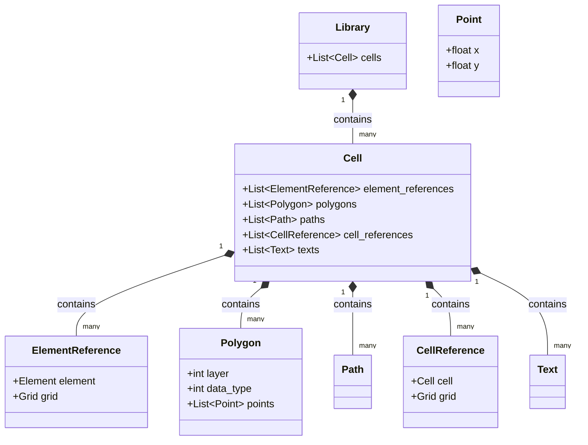

# Class Diagrams

### Class diagrams for gdsr

```mermaid
classDiagram
    class Library {
        +List~Cell~ cells
    }

    Library "1" *-- "many" Cell : contains

    class Cell {
      +List~ElementReference~ element_references
      +List~Polygon~ polygons
      +List~Path~ paths
      +List~CellReference~ cell_references
      +List~Text~ texts
    }

    class ElementReference {
        +Element element
        +Grid grid
    }
    class Polygon {
        +int layer
        +int data_type
        +List~Point~ points
    }
    class Path
    class CellReference {
        +Cell cell
        +Grid grid
    }
    class Text

    class Point {
        +float x
        +float y
    }

    Cell "1" *-- "many" ElementReference : contains
    Cell "1" *-- "many" Polygon : contains
    Cell "1" *-- "many" Path : contains
    Cell "1" *-- "many" CellReference : contains
    Cell "1" *-- "many" Text : contains
```

