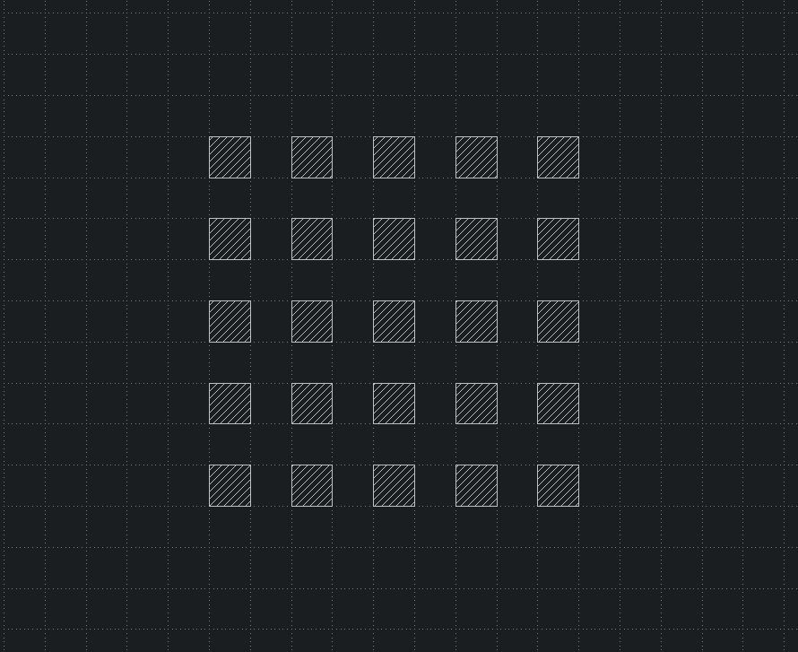

# Welcome to GDSR

GDSR is a easy-to-use and fast [GDSII](https://en.wikipedia.org/wiki/GDSII) manipulation [Python package](https://pypi.org/project/gdsr/) build in Rust.

Some notable features of gdsr are:

- **Strictly typed**: Thorough python type hints
- **Fast to Code**: Due to many [features](#interesting-features)
- **Easy to Code**: Designed to be very intuitive.

## Installation

Use a virtual environment then install gdsr

I recommend using [uv](https://github.com/astral-sh/uv)

```bash
pip install uv
uv venv

source .venv/bin/activate
# or
.venv/Scripts/activate

uv pip install gdsr
```

## External Tools

You may be wondering how you can view your generated files.

[KLayout](https://www.klayout.de/build.html) is an open source gdsii viewer and editor and its strongly recommended that you download it.

## Example

In this example we will create a simple 5x5 grid of polygons

```python
from gdsr import Cell, Grid, Polygon, Reference

polygon = Polygon([(0, 0), (1, 0), (1, 1), (0, 1), (0, 0)])

reference = Reference(
    polygon, Grid(columns=5, rows=5, spacing_x=(2, 0), spacing_y=(0, 2))
)

cell = Cell("example")

cell.add(reference)

cell.to_gds("example.gds")
```



## Interesting features

GDSR makes use of many of Python's dunder methods. Below is an example that shows how dunder methods make GDSR so easy to use.

```Python
from gdsr import Library, Cell

library = Library()

cell = Cell("Main")

library.add(cell)

assert cell in library
```

Here the `in` keyword comes from the [Library.__ contains __ ](/python-api/library#gdsr.Library.__contains__)