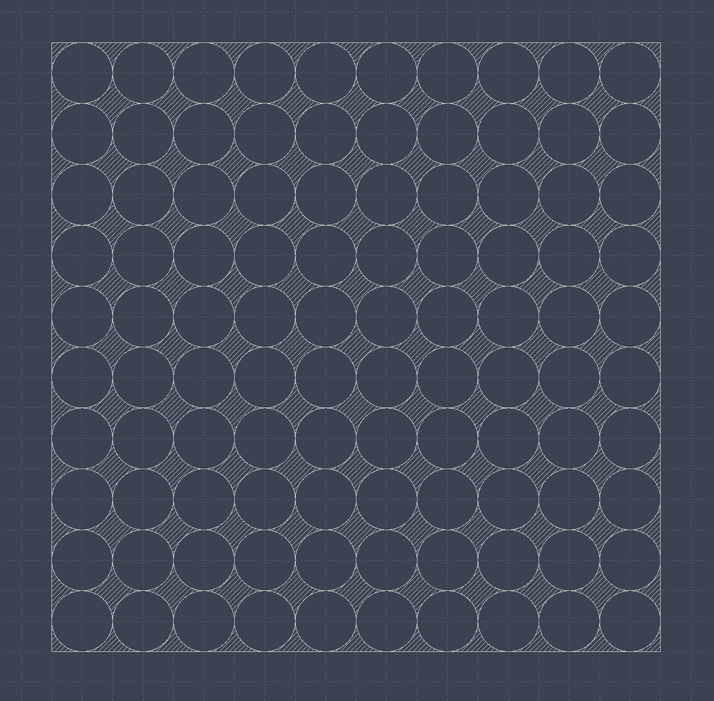

# Boolean Tools

The `gdsr` library provides tools for performing boolean operations on polygons, paths and references. Text elements are not supported.

The boolean operations are performed using the [`geo` crate](https://docs.rs/geo/latest/geo/index.html). Because of this, the boolean operations may panic and are not fully robust.

## Boolean Operations

The `gdsr` library provides the following boolean operations:

- `or`: Union
- `and`: Intersection
- `sub`: Subtraction
- `xor`: Symmetric difference

## Examples

In the following example we will create a polygon and subtract reference of 10x10 grid of circles from it. This results in a nice pattern that is very easy to create.

```python
import gdsr

square = gdsr.Polygon([(0, 0), (0, 10), (10, 10), (10, 0), (0, 0)])
circle = gdsr.Polygon.ellipse((0.5, 0.5), 0.5, 0.5)

circle_grid = gdsr.Reference(
    circle, gdsr.Grid(columns=10, rows=10, spacing_x=(1, 0), spacing_y=(0, 1))
)

res = square - circle_grid

cell = gdsr.Cell("test")
cell.add(*res)

cell.to_gds("test.gds")
```



::: gdsr.typings.BooleanOperationInput

::: gdsr.typings.BooleanOperationOperation

::: gdsr.typings.BooleanOperationResult

::: gdsr.boolean